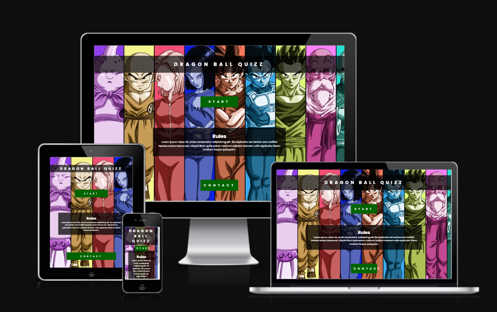
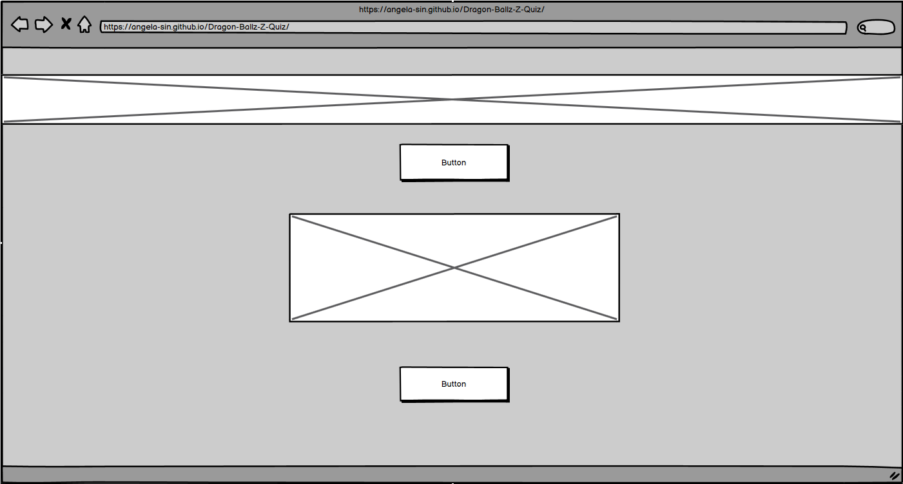
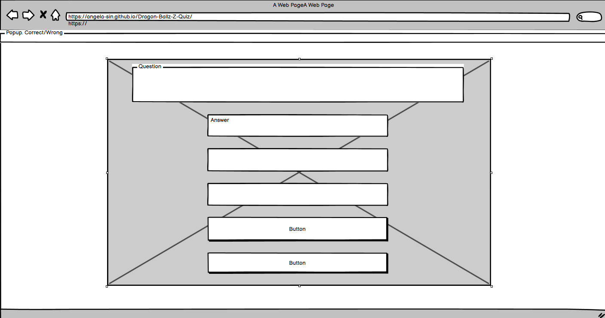
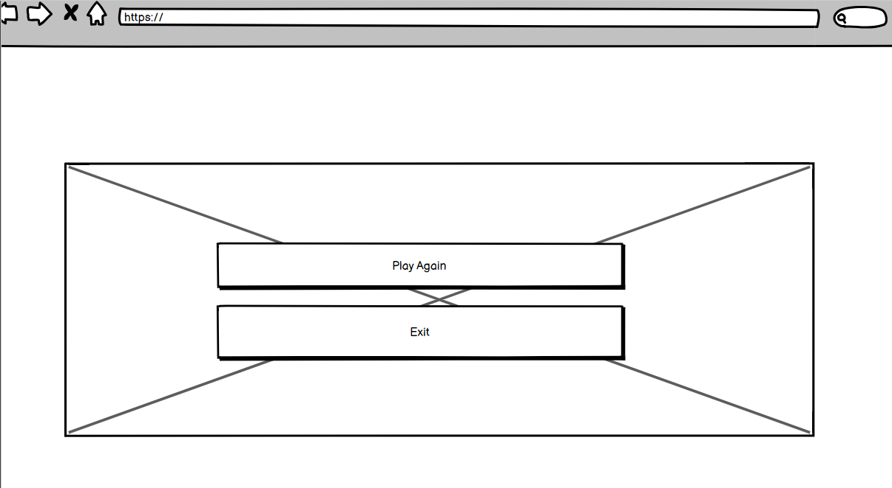
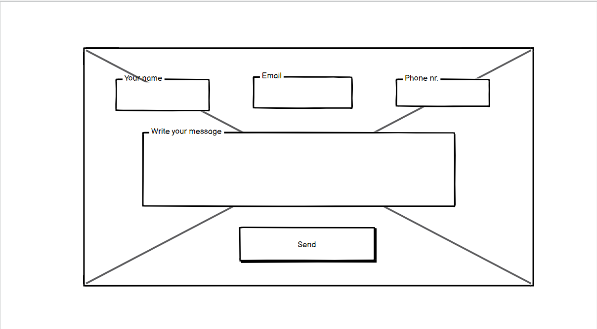
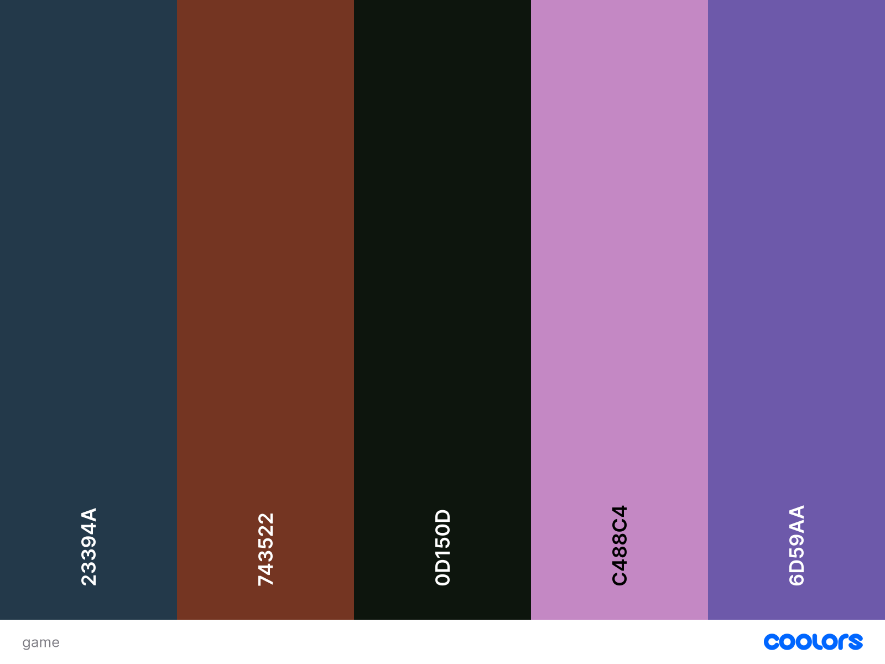
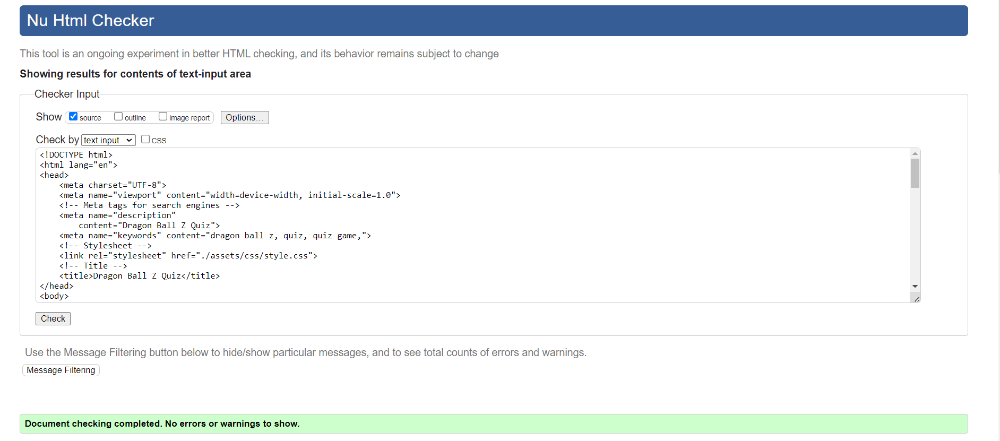
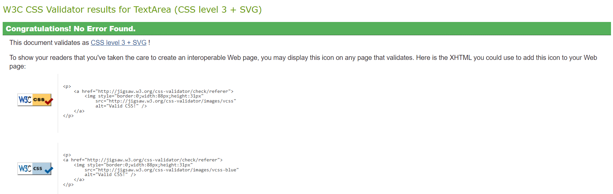

# Dragon Ball Z quiz Game
Dragon Ball Z quiz PP2

## About me

## Project Overview

## User Interface - In-Game UI

- **As a player, I want a clear and intuitive user interface that shows my score, lives, and level progress so that I can easily understand my current game status.**

  - 
  - 

- **As a player, I want to be able to read credits.**

  - Include a credits screen at the end of the game.

- **As a player, I want a menu in a game that gives me options.**

  - 
  - 
  - 

- **As a player, I want to control where the character drops the projectile using keyboard/mouse inputs so that I can interact with the game.**

  - 

- **As a player, I want to experience different levels or stages in the game so that I can enjoy a sense of progression and challenge.**

  - 
  - Transition between levels should be smooth and provide text-based feedback.
  - 

- **As a player, I want to hear background music that complements the retro theme so that the game environment feels immersive.**

  - 
  - 
  - 
  - 
  - 

- **As a player, I want to see instructions and controls at the start of the game so that I know how to play and what actions are available.**

  - Instructions are displayed at the start of the game.
  - Instructions should clearly describe controls and gameplay mechanics.
  - Instructions should be easy to read and navigate.

## Our Contributions

- **As a developer, I need to prepare the game for deployment on various platforms (web, desktop, etc.) so that players can access and play the game in their preferred environment.**

  - The game is packaged and configured for deployment on target platforms.
  - Platform-specific issues are resolved and documented.
  - Deployment instructions are included in the documentation.

- **As a developer, I need to ensure that the game is optimized for performance so that it runs smoothly and efficiently on target devices.**

  - The game’s performance is tested and optimized for speed and resource usage.
  - Any performance bottlenecks are identified and addressed.
  - The game should maintain consistent frame rates and responsiveness.

- **As a developer, I need to integrate various sprites (characters, enemies, items) into the game so that the game has a visually engaging experience.**

  - Sprites for the main character, enemies, and interactive items are available and correctly displayed.
  - Sprites should be loaded and rendered efficiently without causing performance issues.

- **As a developer, I need to ensure that the game's visual style matches the retro theme so that the game maintains a consistent aesthetic.**
  - Visual elements such as backgrounds, sprites, and UI components adhere to the 8-bit gaming style (e.g., pixel art).
  - The color palette and graphical effects should reflect a classic gaming era.

## Design

- ### Wireframes

For all Media queries, Wireframes are the same!

  - Landing Page -

  - Quiz-game Page -

  - Play-Again/Exit Page -
  

  - Contact Page  -

- ### Color Pallete

  

- ## Background
  

## Features

- Challenge

## Technologies Used

### Languages Used

- [HTML5](https://en.wikipedia.org/wiki/HTML5)
- [CSS3](https://en.wikipedia.org/wiki/Cascading_Style_Sheets)
- [JavaScript](https://en.wikipedia.org/wiki/JavaScript)

### Frameworks, Libraries & Programs Used

## Testing

The W3C Markup Validator and W3C CSS Validator Services were used to validate every page of the project to ensure there were no syntax errors in the project.

- [W3C Markup Validator](https://jigsaw.w3.org/css-validator/#validate_by_input)
  
- [W3C CSS Validator](https://jigsaw.w3.org/css-validator/#validate_by_input)
  

### Further Testing

- The Website was tested on Google Chrome, Internet Explorer, Microsoft Edge, and Safari browsers.
- Friends and family members were asked to review the site and documentation to point out any bugs and/or user experience issues.

### Future adding

- 

## Getting Started

First, fork the repository. Then, go into your preferred code editor.

1. git clone [https://github.com/YOUR-USERNAME/YOUR-REPOSITORY]
2. cd game
3. npm install
4. npm run serve

## Deployment

### GitHub Pages

The project was deployed to GitHub Pages using the following steps...

1. Log in to GitHub and locate the [GitHub Repository](https://github.com/)
2. At the top of the Repository (not the top of the page), locate the "Settings" Button on the menu.
   - Alternatively, Click [Here](https://raw.githubusercontent.com/) for a GIF demonstrating the process starting from Step 2.
3. Scroll down the Settings page until you locate the "GitHub Pages" Section.
4. Under "Source", click the dropdown called "None" and select "Master Branch".
5. The page will automatically refresh.
6. Scroll back down through the page to locate the now-published site [link](https://github.com) in the "GitHub Pages" section.

### Forking the GitHub Repository

By forking the GitHub Repository we make a copy of the original repository on our GitHub account to view and/or make changes without affecting the original repository by using the following steps...

1. Log in to GitHub and locate the [GitHub Repository](https://github.com/)
2. At the top of the Repository (not the top of the page) just above the "Settings" Button on the menu, locate the "Fork" Button.
3. You should now have a copy of the original repository in your GitHub account.

### Making a Local Clone

1. Log in to GitHub and locate the [GitHub Repository](https://github.com/)
2. Under the repository name, click "Clone or download".
3. To clone the repository using HTTPS, under "Clone with HTTPS", copy the link.
4. Open Git Bash
5. Change the current working directory to the location where you want the cloned directory to be made.
6. Type `git clone`, and then paste [https://github.com/YOUR-USERNAME/YOUR-REPOSITORY] in.
7. Press Enter. Your local clone will be created.

8. $ git clone [https://github.com/YOUR-USERNAME/YOUR-REPOSITORY]
9. Cloning into `CI-Clone`...
10. remote: Counting objects: 10, done.
11. remote: Compressing objects: 100% (8/8), done.
12. remove: Total 10 (delta 1), reused 10 (delta 1)
13. Unpacking objects: 100% (10/10), done.

Click [Here](https://help.github.com/en/github/creating-cloning-and-archiving-repositories/cloning-a-repository#cloning-a-repository-to-github-desktop) to retrieve pictures for some of the buttons and more detailed explanations of the above process.

### Content

- All content was written by me.

## Resources Used

| Source                                                                                                               | Location       | Notes                        |
| -------------------------------------------------------------------------------------------------------------------- | -------------- | ---------------------------- |
| [YouTube](https://www.youtube.com/)                                                                                  | Acros website  | Tutorial for troubleshouting |
| [WebAIM ](https://webaim.org/)                                                                                       | Acros website  | Contrast Checker             |
| [Fonts Google](https://fonts.google.com/)                                                                            | Across website | Font selection               |
| [Coolors](https://coolors.co/)                                                                                       | Across website | Colour palette selection     |
| [W3Schools](https://www.w3schools.com/)                                                                              | Across website | Various help pages           |
| [Balsamiq](https://balsamiq.com/?gad_source=1&gclid=EAIaIQobChMI9-DR99b-hwMV9JtQBh0I3yMEEAAYASAAEgJTpPD_BwE)         | Across website | Wireframes creation          |

### Acknowledgements

- Special mention is also deserved by my mentor Medale Oluwafemi. 
- As a tutoring team as well.

