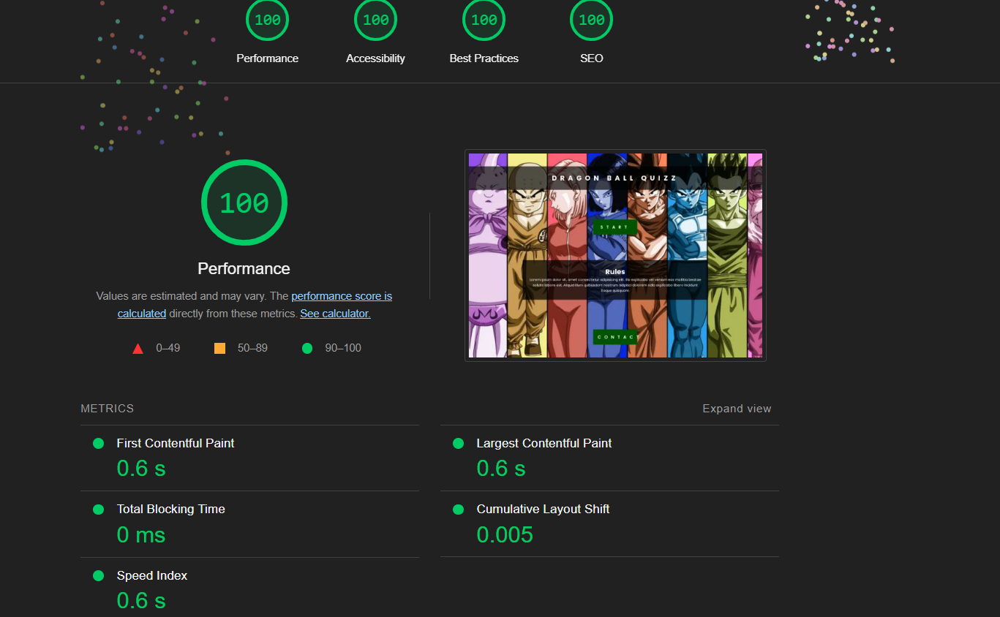

# Dragon Ball Z quiz Game
Dragon Ball Z quiz  pp2 [Quiz](https://8000-angelasin-dragonballzzq-vy0ruqnxb6h.ws.codeinstitute-ide.net/)

## About me

## Project Overview

Dragon Ball Z is a hugely popular Japanese anime series that follows the adult life of the main character Goku. In the action-packed show, Goku and his friends defend their planet from magical villains and intergalactic space fighters. Powerful villains often threaten the heroes and their world. The series originally aired from 1989 to 1996, with new episodes airing from 2009 to 2015. Over the course of 13 years, fans have watched 291 episodes, and true Dragon Ball Z experts have watched them all. Do you know enough about Dragon Ball Z to consider yourself a superfan? Take this quiz to find out!

This quiz is to test your knowledge of Dragon Ballz. 

## User Interface - In-Game UI

- As user I want this website to be responsive to different devices.
- As user I want to check my scores.
- As user I want to know if I selected the correct option.
- As user I want to easily navigate on this website.
- As user I want to leave feedback and send a message or ask questions.
- As user I want to understand the purpose of the site quickly to see if I want to play.
- As user I want to easily replay the quiz so I can try to get a better score.
- As user I want to get an alert if I've forgotten to answer a question so I don't miss an opportunity to increase my score.

## Mine Contributions

- **As a developer, I need to prepare the game for deployment on various platforms (web, desktop, etc.) so that players can access and play the game in their preferred environment.**

  - The game is packaged and configured for deployment on target platforms.
  - Platform-specific issues are resolved and documented.
  - Deployment instructions are included in the documentation.
  - The game should maintain consistent frame rates and responsiveness.

## Design

- ### Wireframes

For all Media queries, Wireframes are the same!

  - Landing Page -

  - Quiz-game Page -

  - Play-Again/Exit Page -
  
  - Contact Page  -

- ### Color Pallete
The color scheme was defined using the colors on the background picture.

  

- ## Background
The image helps the user to quickly identify the purpose of the site (i.e. a quiz).

  

  
- ## Icon

[Icon](https://www.kindpng.com/imgv/hbxJibi_dragon-ball-z-png-goku-transparent-png/)

- ## Typography
Google Fonts font Poppins was used as a shrift. [Google Fonts](https://fonts.google.com/?query=poppins)

## Technologies Used

### Languages Used

- [HTML5](https://en.wikipedia.org/wiki/HTML5)
- [CSS3](https://en.wikipedia.org/wiki/Cascading_Style_Sheets)
- [JavaScript](https://en.wikipedia.org/wiki/JavaScript)

### Frameworks, Libraries & Programs Used

## Testing

The W3C Markup Validator and W3C CSS Validator Services were used to validate every page of the project to ensure there were no syntax errors in the project.

- [W3C Markup Validator](https://jigsaw.w3.org/css-validator/#validate_by_input)
  
- [W3C CSS Validator](https://jigsaw.w3.org/css-validator/#validate_by_input)
  
- [https://jshint.com/](https://jshint.com/)
  
  
  
  
  

### Further Testing

- The Website was tested on Google Chrome, Internet Explorer, Microsoft Edge, and Safari browsers.
- The website was tested on numerous sized screens including Mobile phones, iPads, and laptops, and was found to respond as expected to all sizes. Chrome development tools were used throughout the design process to check responsiveness and breakpoints.
- Friends and family members were asked to review the site and documentation to point out any bugs and/or user experience issues.

## Accesability

 - 

 - 

 ## Contrast

 - 

## For future implementations, I would like to:

- Connect the application to a database so that I can increase the number of questions on the questions bank.
- Have different levels for the user to play.
- Have the matches saved into the database so the leaderboard would show all users that play the game, not only the ones by the browser.

## Getting Started

First, fork the repository. Then, go into your preferred code editor.

1. git clone [https://github.com/YOUR-USERNAME/YOUR-REPOSITORY]
2. cd game
3. npm install
4. npm run serve

## Deployment

### GitHub Pages

The project was deployed to GitHub Pages using the following steps...

1. Log in to GitHub and locate the [GitHub Repository](https://github.com/)
2. At the top of the Repository (not the top of the page), locate the "Settings" Button on the menu.
   - Alternatively, Click [Here](https://raw.githubusercontent.com/) for a GIF demonstrating the process starting from Step 2.
3. Scroll down the Settings page until you locate the "GitHub Pages" Section.
4. Under "Source", click the dropdown called "None" and select "Master Branch".
5. The page will automatically refresh.
6. Scroll back down through the page to locate the now-published site [link](https://github.com) in the "GitHub Pages" section.

### Forking the GitHub Repository

By forking the GitHub Repository we make a copy of the original repository on our GitHub account to view and/or make changes without affecting the original repository by using the following steps...

1. Log in to GitHub and locate the [GitHub Repository](https://github.com/)
2. At the top of the Repository (not the top of the page) just above the "Settings" Button on the menu, locate the "Fork" Button.
3. You should now have a copy of the original repository in your GitHub account.

### Making a Local Clone

1. Log in to GitHub and locate the [GitHub Repository](https://github.com/)
2. Under the repository name, click "Clone or download".
3. To clone the repository using HTTPS, under "Clone with HTTPS", copy the link.
4. Open Git Bash
5. Change the current working directory to the location where you want the cloned directory to be made.
6. Type `git clone`, and then paste [https://github.com/YOUR-USERNAME/YOUR-REPOSITORY] in.
7. Press Enter. Your local clone will be created.

8. $ git clone [https://github.com/YOUR-USERNAME/YOUR-REPOSITORY]
9. Cloning into `CI-Clone`...
10. remote: Counting objects: 10, done.
11. remote: Compressing objects: 100% (8/8), done.
12. remove: Total 10 (delta 1), reused 10 (delta 1)
13. Unpacking objects: 100% (10/10), done.

Click [Here](https://help.github.com/en/github/creating-cloning-and-archiving-repositories/cloning-a-repository#cloning-a-repository-to-github-desktop) to retrieve pictures for some of the buttons and more detailed explanations of the above process.

### Content

- The idea and desighn of the quiz was written by me Angela Siniavskaja. 

## Resources Used

| Source                                                                                                               | Location       | Notes                        |
| -------------------------------------------------------------------------------------------------------------------- | -------------- | ---------------------------- |
| [Git](https://git-scm.com/)                                                                                          | Acros website  | for version control |
| [GitHub](https://github.com/)                                                                                        | Acros website  | to store the project files.  |
| [GitPod](https://www.gitpod.io/)                                                                                     | Acros website  | as the IDE for development.  |
| [Readme](https://github.com/Angela-Sin/Retro-Game)                                                                   | Acros website  | As an example, created originally by me for hackathon |
| [YouTube](https://www.youtube.com/)                                                                                  | Acros website  | Tutorial for troubleshooting |
| [Color.Co](https://coolors.co/contrast-checker/ffffff-00000a)                                                                                                        | Acros website  | Contrast Checker             |
| [Fonts Google](https://fonts.google.com/)                                                                            | Across website | Font selection               |
| [Coolors](https://coolors.co/)                                                                                       | Across website | Colour palette selection     |
| [W3Schools](https://www.w3schools.com/)                                                                              | Across website | Various help pages           |
| [HTML Validator](https://validator.w3.org/)                                                                          | Across website | HTML Validator           |
| [CSS Validator](https://jigsaw.w3.org/css-validator/)                                                                | Across website | CSS Validator           |
| [JavaScript Validator](https://jshint.com/)                                                                          | Across website | JavaScript Validator           |
| [Balsamiq](https://balsamiq.com/?gad_source=1&gclid=EAIaIQobChMI9-DR99b-hwMV9JtQBh0I3yMEEAAYASAAEgJTpPD_BwE)         | Across website | Wireframes creation          |
| [Wallpapers.com](https://wallpapers.com/wallpapers/dragon-ball-characters-5edplpjnfbysr3d9/download#google_vignette) | Across website | Background Image             |
| [Lighthouse](https://developer.chrome.com/docs/lighthouse/overview)                                                  | Across website | Speed testing for Mobile and Desctope           |
| [amiresponsive](https://ui.dev/amiresponsive)                                                                        | Across website | was used to take the screenshot with different devices presented at the top of this document.        |
| [Icon](https://www.kindpng.com/imgv/hbxJibi_dragon-ball-z-png-goku-transparent-png/)                                                                                          | Acros website  | Quiz Icon |
| [Project Overview](https://heywise.com/quiz/only-the-biggest-dragon-ball-z-fans-will-ace-this-quiz/)                                                                        | Across website | Project Overview       |

### Acknowledgements

- Special mention is also deserved by my mentor Medale Oluwafemi for helping me understand the requirements and guiding me through the realization of this project!
- As a tutoring team for help and support during the project.

